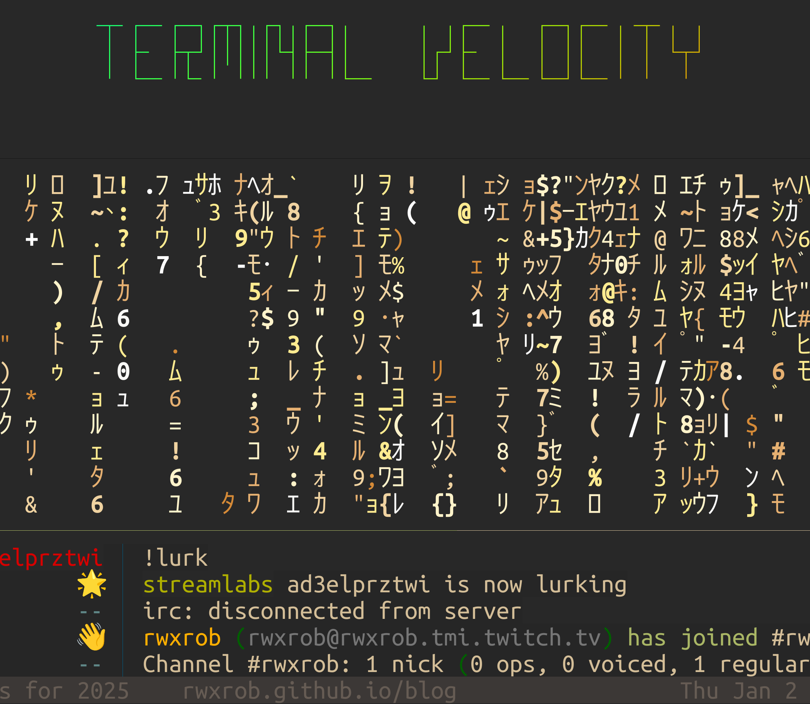

[separator=::]
= Terminal Velocity
:author: Robert S. Muhlestein (rwxrob)
:creator: {author}
:copyright: 2024 {author}
:email: rob@rwx.gg
:revnumber: v0.0.1
:revdate: {date}
:revremark: Under development
:doctype: book
:leveloffset: +1
:front-cover-image: 
:sectnums!:
:sectlinks:
:toc: left
:toclevels: 2
:toc-title: Table of Contents
:description: Boost your coding, hacking, and learning with fastest human-computer interface
:keywords: terminal unix linux tech education tutorials learning techlife hacking cybersecurity cli command-line bash golang programming coding applied-programming independent-learning irc weechat tmux ed ex vi vim neovim nvim w3m lynx twitch proxmox homelab init beginner noob kubernetes network software-development utilities
:icons: font
:xrefstyle: short
:source-highlighter: pygments
:pygments-style: vs
:pygments-linenums-mode: table

_Boost your coding, hacking, and learning with the fastest human-computer interface_

include::front/copyright.adoc[]

include::front/dedication.adoc[]

include::front/preface/welcome.adoc[]

include::front/preface/who-should-read-this.adoc[]

include::front/preface/the-hackers-way.adoc[]

include::front/preface/write-your-own-book.adoc[]

include::front/preface/wax-on-wax-off.adoc[]

include::front/preface/dont-just-read.adoc[]

include::front/preface/get-an-ai.adoc[]

include::front/preface/trust-me-kiddo.adoc[]

include::front/preface/parents-and-pedagogues.adoc[]

include::boost.adoc[]

include::terms.adoc[]

//include::preface/hackers-perspective.adoc[]

// ———————— setup a terminal ————————

//include::set-up-a-terminal/index.adoc[]

// ———————— get unix or linux ————————

//include::get-unix-linux/index.adoc[]

// ——————— setup a terminal ———————

//include::start-using-terminal/index.adoc[]

// ——————— create a learning lab ———————

//include::create-lab-repo/index.adoc[]

// ———————— grok your config ————————

//include::grok-your-configs/index.adoc[]

// ——————— code for the terminal ———————

//include::code-for-terminal/index.adoc[]

// ———————— plan your next op ————————

//include::plan-your-next-op/index.adoc[]

//include::terminal-origins.adoc[]

//include::first-terminal/-launcher.adoc[]

//include::learn-alt-tab.adoc[]

//include::manage-software/index.adoc[]

//include::get-wsl2-on-windows.adoc[]

//include::install-xdg-utils.adoc[]

//include::update-bash-on-macos.adoc[]

//include::validate-bash-on-linux.adoc[]

//include::get-git-github.adoc[]

//include::start-dotfiles.adoc[]

//include::config-bash.adoc[]

//include::config-wezterm.adoc[]

